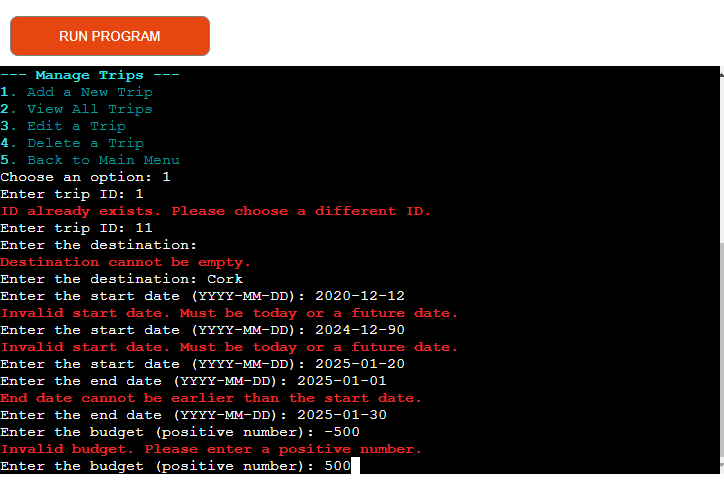

# Testing

Once the portal was operational I set about testing it for errors and to ensure any possible errors that can be made were caught.

The deployed project live link is [HERE](https://travellingplanner-f3f27e55bd6d.herokuapp.com/) - ***Use Ctrl (Cmd) and click to open in a new window.*** 

The following tests were carried out to ensure the portal is working correctly

| Feature            | Action                                                    | Expected Result                                                     | Actual Result      |
| ------------------ | --------------------------------------------------------- | ------------------------------------------------------------------- | ------------------ |
| Trip Management    |                                                           |                                                                     |                    |
| Create Trip        | Enter a valid trip ID.                                    | The trip is created with the given ID.                              | Works as expected. |
|                    | Enter an invalid trip ID (e.g., negative or blank).       | Error message: "Invalid Trip ID. Must be positive."                 | Works as expected. |
|                    | Leave destination blank.                                  | Error message: "Destination cannot be empty."                       | Works as expected. |
|                    | Enter start and end dates in correct format (YYYY-MM-DD). | Dates are accepted without error.                                   | Works as expected. |
|                    | Enter dates in an incorrect format or invalid order.      | Error message: "Invalid date format."                               | Works as expected. |
| Edit Trip          | Edit with a valid trip ID.                                | Trip details are updated successfully.                              | Works as expected. |
|                    | Edit with a non-existent trip ID.                         | Error message: "Trip ID not found."                                 | Works as expected. |
|                    | Enter an invalid budget (e.g., negative or non-numeric).  | Error message: "Invalid budget. Enter positive."                    | Works as expected. |
| Itinerary Planning |                                                           |                                                                     |                    |
| Add Itinerary      | Enter valid activity details with a valid trip ID.        | The itinerary entry is added.                                       | Works as expected. |
|                    | Enter an invalid trip ID.                                 | Error message: "Trip ID not found."                                 | Works as expected. |
|                    | Leave activity or date blank.                             | Error message: "Activity and date cannot be empty."                 | Works as expected. |
| Expense Tracking   |                                                           |                                                                     |                    |
| Add Expense        | Enter valid expense details with a valid trip ID.         | Expense is added successfully.                                      | Works as expected. |
|                    | Enter a non-numeric or negative amount.                   | Error message: "Enter a valid, non-negative amount."                | Works as expected. |
|                    | Leave category or description blank.                      | Error message: "Field cannot be empty."                             | Works as expected. |
| Edit Expense       | Edit an expense with a valid ID.                          | Expense details are updated successfully.                           | Works as expected. |
|                    | Enter a non-existent expense ID.                          | Error message: "Expense ID not found."                              | Works as expected. |
| Input Validation   |                                                           |                                                                     |                    |
| Date Validation    | Enter dates in the correct format (YYYY-MM-DD).           | Dates are accepted without error.                                   | Works as expected. |
|                    | Enter dates in an incorrect format or past date.          | Error message: "Invalid date. Must be a future date."               | Works as expected. |
| Budget Validation  | Enter a positive number.                                  | Budget is accepted.                                                 | Works as expected. |
|                    | Enter non-numeric or negative values.                     | Error message: "Please enter a positive number."                    | Works as expected. |
| General            |                                                           |                                                                     |                    |
| Summary Dashboard  | Access the summary.                                       | Displays the summary of all trips, expenses, and itinerary entries. | Works as expected. |
|                    | Access when no trips/itinerary/expenses exist.            | Message: "No data found."                                           | Works as expected. |

## Trip management tests

## Itinerary management tests

## Expenses management tests

## Python validation test

## Testing Browsers
The portal was tested in the following browsers (based on my own testing and those of people who tested the portal):

- Chrome
- Edge
- Firefox
- Oprea
- Safari

It worked without issues in the above browsers.